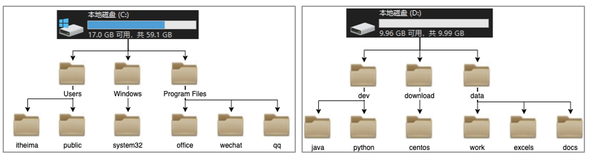
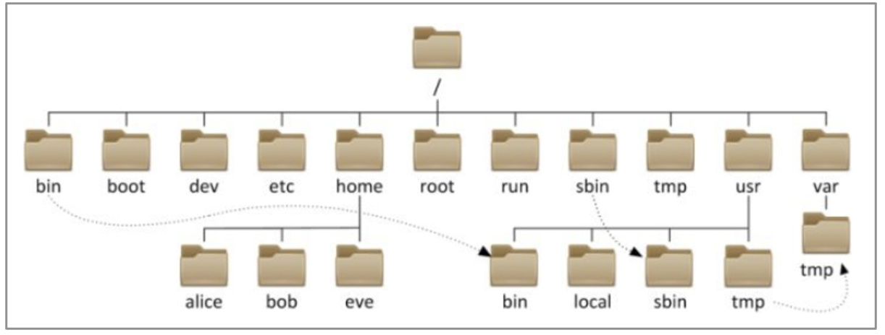

# Linux 的目录结构

## 一、Linux 树形目录结构

Windows 系统可以拥有多个盘符, 如 C盘、D盘、E盘

Linux 的目录结构是一个树型结构

Linux 没有盘符这个概念, 只有一个根目录 /，所有文件都在它下面

## 二、Linux 的路径描述方式

在 Windows 系统中，路径之间的层级关系，使用：反斜杠  `\`  来表示

比如：`D:\data\work\hello.txt`

- `D:` 表示 D 盘
- `\` 表示层级关系

在 Linux 系统中，路径之间的层级关系，使用：斜杠 `/`  来表示

比如：`/usr/local/hello.txt`

- 开头的 `/` 表示根目录
- 后面的 `/` 表示层级关系

## 三、练习

请根据语言描述，写出对应的 Linux 路径：

在根目录下有一个文件夹 test，文件夹内有一个文件 hello.txt，请描述文件的路径

`/test/hello.txt`

在根目录下有一个文件 test.txt，请描述文件的路径：

`/test.txt`

在根目录下有一个文件夹 zetian，下面有文件夹 haha，下面有文件 test.txt，请描述文件的路径

`/zetian/haha/test.txt`
