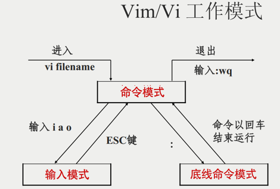

# vi、vim 编辑器

## 一、vi、vim 编辑器介绍

vi \ vim 是 visual interface 的简称, 是 Linux 中最经典的文本编辑器。

同图形化界面中的文本编辑器一样，vi 是命令行下，对文本文件进行编辑的绝佳选择。

vim 是 vi 的加强版本，兼容 vi 的所有指令，不仅能编辑文本，而且还具有 shell 程序编辑的功能，可以不同颜色的字体来辨别语法的正确性，极大方便了程序的设计和编辑性。

## 二、vi、vim 编辑器三种工作模式

命令模式（Command mode）

- 该模式下，所敲的按键编辑器，都理解为命令，以命令驱动执行不同的功能。
- 该模型下，不能自由进行文本编辑。

输入模式（Insert mode）

- 也就是所谓的编辑模式、插入模式。
- 该模式下，可以对文件内容进行自由编辑。

底线命令模式（Last line mode）

- 以 `:` 开始，通常用于文件的保存、退出。



由上图可知，命令模式是核心的中转站。

### 1.命令模式

vim 兼容全部的 vi 功能，如果需要通过 vi / vim 编辑器编辑文件，请通过如下命令：

`vi 文件路径`

`vim 文件路径`

如果文件路径表示的文件不存在，那么此命令会用于创建新文件，并编辑.。

如果文件路径表示的文件存在，那么此命令用于编辑已有文件。

快速体验：

通过 vi / vim 命令编辑文件，会打开一个新的窗口，此时这个窗口就是：命令模式窗口

```shell
vim abc.txt
```

```shell
                                              
~                                                                                                                                                                                           
~                                                                                                                                                                                           
~                                                                                                                                                                                           
~                                                                                                                                                                                           
"abc.txt" [新文件]  
```

命令模式是 vi 编辑器的入口和出口，如上图

•进入vi编辑器会进入命令模式

•通过命令模式输入键盘指令，可以进入输入模式

•输入模式需要退回到命令模式，然后通过命令可以进入底线命令模式


命令模式快捷键

按两下 y，再按 p，发现复制了一行。

按两下 d，删除了一行。

按下 u，撤销

底线命令模式快捷键，

!q 强制推出，抛弃编辑的内容
:set paste 用于从外部复制内容时，同步格式。
