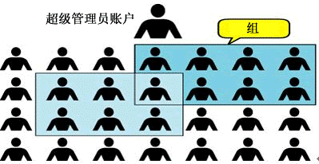

# 用户、用户组

## 一、用户、用户组是什么

Linux 中关于权限的管控级别有 2 个级别，分别是：针对用户的权限控制，针对用户组的权限控制。

比如：针对某文件，可以控制用户的权限，也可以控制用户组的权限。




Linux 系统中可以：配置多个用户，配置多个用户组。

用户可以加入多个用户组中。

## 二、用户组管理

以下命令须使用 root 用户执行。

### 1.创建用户组

创建用户组：`groupadd 用户组名`

创建一个 kkcf 用户组：

```shell
groupadd kkcf
```

### 2.删除用户组

删除用户组：`groupdel 用户组名`

## 三、用户管理

以下命令须以 root 用户执行。

### 1.创建用户

创建用户：`useradd [-g -d] 用户名`

- `-g` 选项：可选，指定用户的组，不写会创建与用户同名的组并自动加入；如已存在同名组，必须使用 -g；指定的组必须已经存在。
- `-d` 选项：可选，指定用户 HOME 路径，不指定，HOME 目录默认在：/home/用户名

### 2.删除用户

删除用户：`userdel [-r] 用户名`

- `-r` 选项，可选，表示删除用户的 HOME 目录，不写则删除用户时，HOME 目录保留

### 3.查看用户所属组

查看用户所属组：`id [用户名]`

- `用户名` 参数，可选，表示被查看的用户，不写则查看自身。

### 4.修改用户所属组

修改用户所属组：`usermod -aG 用户组 用户名`

- 表示将指定用户加入指定用户组

## 四、getent 命令

### 1.查看用户

查看系统中所有用户。

语法：`getent passwd`

```she
[root@iZwz9clzmhmmlb65bbcvuuZ ~]# getent passwd
root:x:0:0:root:/root:/bin/bash
...
zetian:x:1000:1000::/home/zetian:/bin/bash
```

输出共 7 份信息，分别是：用户名、密码（X，不会明文展示）、组 ID、描述信息（无用）、HOME 目录、执行终端（默认 bash）

### 2.查看用户组

查看系统中所有用户组。

使用 getent 命令，同样可以查看当前系统中有哪些用户组。

语法：`getent group`

```shell
[root@iZwz9clzmhmmlb65bbcvuuZ ~]# getent group
root:x:0:
...
kkcf:x:1000:zetian
```

包含 3 份信息，组名称、组认证（显示为 x)、组 ID。

