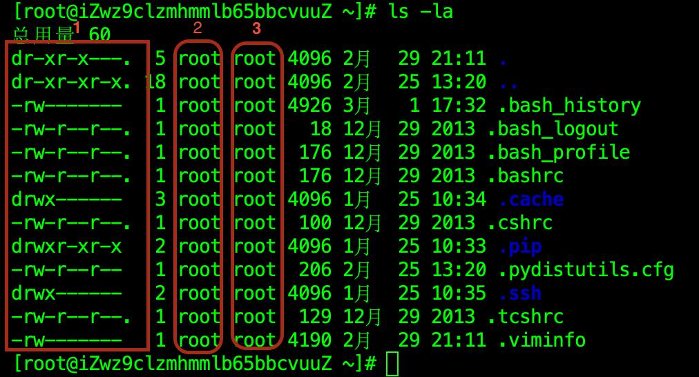
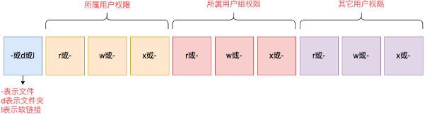

# 查看权限控制信息

## 一、权限信息的认知

执行 `ls -l` 命令，可以以列表形式查看内容，并显示权限细节



序号1，表示文件、文件夹的权限控制信息。

序号2，表示文件、文件夹所属用户。

序号3，表示文件、文件夹所属用户组。

让我们来解析一下序号 1 中的权限细节，其中总共分为 10 个槽位



针对序列 1 举例：drwxr-xr-x，分析：

- 首字母 d 表示：表示这是一个文件夹（- 表示文件，l 表示软链接）。
- 所属用户的权限是：有 r、有 w、有 x，即 rwx。
- 所属用户组的权限是：有 r、无 w、有 x，即 r-x （- 表示无此权限）
- 其它用户的权限是：有 r、无 w、有 x，即 r-x

## 二、rwx 权限

那么，rwx 到底代表什么呢？

- r 表示读权限。
- w 表示写权限。
- x 表示执行权限。

针对文件、文件夹的不同，rwx 的含义有细微差别

- r，针对文件，表示可以查看文件内容；针对文件夹，表示可以查看文件夹内容，比如：执行 ls 命令查看。
- w，针对文件，表示可以修改此文件；针对文件夹，表示可以在文件夹内：创建、删除、改名等操作。
- x，针对文件，表示可以将文件作为程序执行；针对文件夹，表示可以更改工作目录到此文件夹，即执行 cd 命令进入文件夹。

查看 / 目录下的内容对应的权限：

```shell
[root@iZwz9clzmhmmlb65bbcvuuZ ~]# ls -l /
总用量 60
...
dr-xr-x---.  5 root root  4096 2月  29 21:11 root
...
```

切换到用户 zetian，执行命令

```bash
-bash-4.2$ touch /root/hello.txt
touch: cannot touch ‘/root/hello.txt’: Permission denied
```

```bash
-bash-4.2$ cd /root
-bash: cd: /root: Permission denied
```

```bash
-bash-4.2$ ls /root
ls: cannot open directory /root: Permission denied
```

发现读取、写入、执行都是没有权限的。
