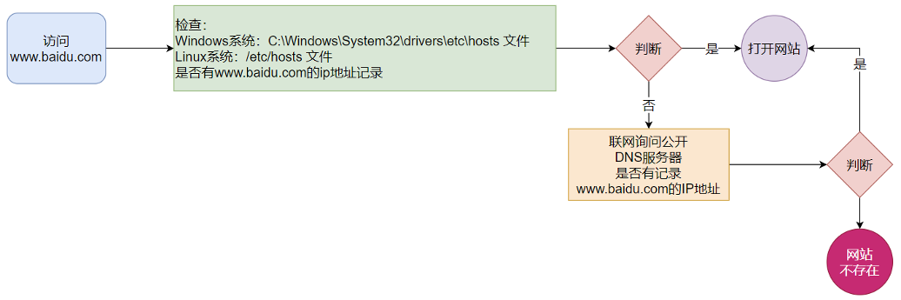

# ip 地址和主机名

## 一、ip 地址

每一台联网的计算机，都会有一个地址，用于和其它计算机进行通讯。

IP 地址主要有 2 个版本，V4 版本和 V6 版本。

### 1.IPv4 中的十进制和二进制

IPv4 版本的地址格式是：a.b.c.d；其中 a、b、c、d 表示 0~255 的数字，如 `192.168.88.101` 就是一个标准的 IP 地址。

ip 地址底层是二进制的，下面是一些十进制数对应的二进制数：

| 十进制 | 二进制   |
| ------ | -------- |
| 0      | 0        |
| 1      | 1        |
| 2      | 10       |
| 4      | 100      |
| 8      | 1000     |
| 16     | 10000    |
| 32     | 100000   |
| 64     | 1000000  |
| 128    | 10000000 |

我们发现，每当十进制为 1，2，4，8，16，32，64，128 时，对应的二进制数，第一位都是 1，后面位都是 0。

依据以上规律，计算得出十进制 255 对应的二进制数：

- 因为：255 = 128 + 64 + 32 + 16 + 4 + 2 + 1；
- 所以，255 对应的二进制是 11111111。

依据以上对照表，计算得出十进制 132 对应的二进制数：

- 因为：132 = 128 + 4；
- 所以：132 对应的二进制是 10000100

ip 地址是由 4 组 8 位二进制数组成的，每一组之间，都由一个点来隔开：`XXXXXXXX.XXXXXXXX.XXXXXXXX.XXXXXXXX`，所以 ip 地址是有 32 位二进制数的。

### 3.网络号、主机号

ip 地址由两个部分组成，分别是“网络号”和“主机号”，比如以下一组 ip 地址中：

- 130.20.11.1
- 130.20.11.2
- 130.20.11.3
- 130.20.11.4

`130.20.11` 部分代表**网络号**，后面的 `.1`、`.2`、`.3` 部分代表**主机号**。

### 4.ABCDE 类

ip 地址划分为 A、B、C、D、E 类。D、E 是特殊类。

| 类   | 范围                        | 网络数  | 主机数   |
| ---- | --------------------------- | ------- | -------- |
| A    | 0.0.0.0 - 127.255.255.255   | 128     | 16777216 |
| B    | 128.0.0.0 - 191.255.255.255 | 16384   | 65536    |
| C    | 192.0.0.0 - 223.255.255.255 | 2097152 | 256      |

我们会发现，每一类的 ip 地址的网络数、主机数，要么很多，要么很少。

如果有某一块区域 X，被分配了一个 C 类网络号：195.10.10.x，那么这个 C 类地址，理论上可以有 256 个主机数。因为 195.10.10.0 - 195.10.10.255，一共有 256 个主机数。

但是，如果 X 区域，实际有 257 个主机，需要 257 个 IP 地址呢？那么就要考虑再分配一个 C 类地址给该区域，这样就浪费掉了 255（256 - 1）个ip 地址。

同样的道理，如果某一块区域 Y，只有 1 个主机，只需要 1 个 ip 地址，那么分配给它一个 C 类地址，也会造成 255（256 - 1）个 ip 地址的浪费。

为了解决上述简单分配，导致的 ip 地址分配不合理，就诞生了子网掩码。

### 4.子网掩码

假如某一块区域 Z，其中只有 4 个主机，只需要 4 个 ip 地址。它被分配了一个 C 类 ip 地址是 192.168.0.x，x 的范围可以是 0 - 255.。

那么，现在仅需要 `192.168.0.0`  - `192.168.0.3` 这四个 ip 地址即可。剩下的 `192.168.0.4` - `192.168.0.255` 的地址都不需要。

现在，用一种方法，将 `192.168.0.0`  - `192.168.0.3` 这四个 ip 地址表示为同属一个网络。这时，就需要用到子网掩码。

子网掩码，用于划分网络号和主机号。

将 Z 区域所需要的四个 ip 地址，由十进制转为二进制：

| 十进制      | 二进制                              |
| ----------- | ----------------------------------- |
| 192.168.0.0 | 11000000.10101000.00000000.00000000 |
| 192.168.0.1 | 11000000.10101000.00000000.00000001 |
| 192.168.0.2 | 11000000.10101000.00000000.00000010 |
| 192.168.0.4 | 11000000.10101000.00000000.00000011 |

观察上面的对应关系，可知，这四个 32 位的二进制 Ip 地址，前 30 位都是一样的，即 `11000000.10101000.00000000.000000`

现在，编写对应的子网掩码：

- 用二进制 1，对前 30 位进行锁定，表示为 `11111111.11111111.11111111.111111`；
- 用二进制 0，来表示后 2 位不锁定，即表示为 `00`

那么子网掩码就可以表示为：`11111111.11111111.11111111.11111100`，转为十进制后就是 `255.255.255.252`

将区域 Z 中，主机的 ip 地址和子网掩码放在一起（如 192.168.0.2/255.255.255.252），人们就知道网络号和主机号的界限在哪了。

### 5.子网掩码的 CIDR 表示

然而，这么表示很麻烦，通常我们会用 CIDR 的方法来表示，即 `192.168.0.0/30`。其中 30 表示子网掩码前 30 位是被锁定的。

### 6.子网掩码的练习

练习：IP 地址 192.168.50.10/255.255.192.0 的主机号和网络号分别是什么？CIDR 写法是什么？

| ip地址/子网掩码十进制 | ip地址/子网掩码二进制               |
| --------------------- | ----------------------------------- |
| 192.168.50.10         | xxxxxxxx.xxxxxxxx.00110010.xxxxxxxx |
| 255.255.192.0         | 11111111.11111111.11000000.00000000 |

根据以上对比，可知：

- 网络号是：`192.168`；
- 主机号是 `50.10`，
- 子网掩码的 CIDR 写法是 `192.168.0.0/18`

### 5.Linux 命令

`ifconfig` 命令，可以查看本机的 ip 地址。

> 如无法使用 ifconfig 命令，可以在 CentOS 发行版中安装 net-tools 工具
>
> ```shell
> yum -y install net-tools
> ```

```shell
ifconfig
```

```shell
[root@iZwz9clzmhmmlb65bbcvuuZ ~]# ifconfig
eth0: flags=4163<UP,BROADCAST,RUNNING,MULTICAST>  mtu 1500
        inet 172.24.117.141  netmask 255.255.240.0  broadcast 172.24.127.255
        inet6 fe80::216:3eff:fe14:401d  prefixlen 64  scopeid 0x20<link>
        ether 00:16:3e:14:40:1d  txqueuelen 1000  (Ethernet)
        RX packets 3589274  bytes 531255589 (506.6 MiB)
        RX errors 0  dropped 0  overruns 0  frame 0
        TX packets 4257892  bytes 849936830 (810.5 MiB)
        TX errors 0  dropped 0 overruns 0  carrier 0  collisions 0

lo: flags=73<UP,LOOPBACK,RUNNING>  mtu 65536
        inet 127.0.0.1  netmask 255.0.0.0
        inet6 ::1  prefixlen 128  scopeid 0x10<host>
        loop  txqueuelen 1000  (Local Loopback)
        RX packets 0  bytes 0 (0.0 B)
        RX errors 0  dropped 0  overruns 0  frame 0
        TX packets 0  bytes 0 (0.0 B)
        TX errors 0  dropped 0 overruns 0  carrier 0  collisions 0
```

其中：eth0 是主网卡，lo 是本地回环网卡。

> DHCP：用于动态获取 IP 地址，即每次重启设备后都会获取一次，可能导致 IP 地址频繁变更。

某些新的 Ubuntu 版本，不再默认包含 net-tools 工具（`ifconfig` 命令），因此你可能需要使用其他工具，比如 `ip` 命令代替。

`ip` 命令用于显示或操作路由、设备、策略路由以及隧道。它是过时的 `ifconfig` 命令的替代工具。

以下是一些常见的 `ip` 命令用法示例：

显示所有网络接口设备：

```bash
ip link show
```

显示所有 IP 地址：

```bash
ip addr show
```

启用或禁用网络接口设备：

```bash
ip link set dev [device_name] up
ip link set dev [device_name] down
```

其中 `[device_name]` 需要替换为你的设备名称，比如 `eth0` 或 `wlan0`。

显示路由表：

```bash
ip route show
```

添加或删除路由：

```bash
ip route add [network] via [gateway]
ip route del [network] via [gateway]
```

其中 `[network]` 是你想要添加路由的网络，`[gateway]` 是网关。

==使用这些命令需要 sudo 权限==。更多详细的  `ip` 命令用法信息，你可以参考他们的 man 页面，使用 `man ip` 命令来查看。

## 二、特殊 ip 地址

127.0.0.1，这个 IP 地址，是本地回环地址，用于指代本机。

0.0.0.0，是特殊 IP 地址。

- 可以用于指代本机。
- 可以在端口绑定中，用来确定绑定关系。
- 在一些 IP 地址限制中，表示所有 IP 的意思。

## 三、主机名查看、修改

每一台计算机，除了对外联络地址（IP 地址）以外，也可以有一个名字，称之为主机名。

无论是 Windows ，Mac，Linux 系统，都可以给系统设置主机名。

在 Linux 系统中，查看主机名

```shell
hostname
```

```shell
[root@iZwz9clzmhmmlb65bbcvuuZ ~]# hostname
iZwz9clzmhmmlb65bbcvuuZ
```

在 Linux 系统中，修改主机名为 `ZeTianDeCentOS7`。==这个命令需要 root 权限==

```shell
hostnamectl set-hostname ZeTianDeCentOS7
```

```shell
[root@zetiandecentos7 ~]# hostnamectl set-hostname ZeTianDeCentOS7
```

## 四、域名解析

IP 地址难以记忆，有没有什么办法，可以通过主机名，或替代的字符地址，去代替数字形式的 IP 地址呢？

比如，通过 `www.baidu.com`，去访问百度。`baidu.com` 称之为百度的域名。

域名解析器，会将域名，解析为 ip 地址，如下图所示。



域名解析的过程是：

1. 先查看本机的记录（私人地址本 host 文件），各系统的 host 文件路径如下：
   - Mac：/private/etc/hosts
   - Windows：C:\Windows\System32\drivers\etc\hosts
   - Linux：/etc/hosts
2. 再联网去 DNS 服务器（如 114.114.114.114，8.8.8.8，...）询问。

在系统的 host 文件中，配置主机名与 ip 地址的映射关系。

/private/etc/hosts

```shell
66.66.66.66 zetianserver
```

然后在 FinallShell 的新建连接中，主机填写配置好的 `zetianserver`，而非 ip 地址。就能连接远程服务器 `66.66.66.66` 了
