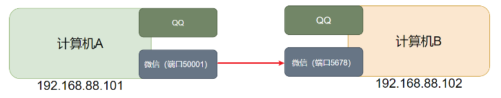

# 端口

## 一、端口是什么？

端口，是设备与外界通讯交流的出入口。端口可以分为：物理端口、虚拟端口两类。

物理端口：又称为接口，是可见的端口，如 USB 接口，RJ45 网口，HDMI 端口等。

虚拟端口：是指计算机内部的端口，是不可见的，是用来操作系统和外部进行交互使用的。

通讯，通过 IP 只能锁定计算机，但是无法锁定具体的程序。


通过端口可以锁定计算机上具体的程序，确保程序之间进行沟通



## 二、端口分区

Linux 系统有 65535 个端口，其中有三个分区：

- 公认端口：1 ~ 1023，通常用于一些系统内置或知名程序的预留使用，非特殊需要，不要占用这个范围的端口。
  - 比如 SSH 服务的 22 端口；HTTPS 服务的 443 端口。

- 注册端口：1024 ~ 49151，通常可以随意使用，用于松散的绑定一些程序、服务。
- 动态端口：49152 ~ 65535，通常不会固定绑定程序，而是当程序对外进行网络连接时，用于临时使用。

> 以上端口片分区，只是一种规范，不是物理约束。

举例：如上图所示，计算机 A 的微信，连接计算机 B 的微信，

- 计算机 A 临时使用 50001 动态端口，作为出口发送请求。
- 计算机 B 的微信长期绑定 5678 注册端口，等待其它计算机连接。

> 动态端口：比如微信发起请求的端口，这次可能是 50001，下次可能是 60001。

## 三、端口占用查看

### 1.nmap 命令。查看指定 ip 暴露的端口

`nmap` 命令，用于查看端口的占用情况。

在 CentOS 发行版，安装 nmap：

```shell
yum -y install nmap
```

语法：`nmap 被查看的IP地址`

查看本机的端口占用情况：

```shell
nmap 127.0.0.1
```

```shell
[root@zetiandecentos7 ~]# nmap 127.0.0.1

Starting Nmap 6.40 ( http://nmap.org ) at 2024-03-06 22:14 CST
Nmap scan report for localhost (127.0.0.1)
Host is up (0.0000080s latency).
Not shown: 997 closed ports
PORT    STATE SERVICE
22/tcp  open  ssh
25/tcp  open  smtp
111/tcp open  rpcbind

Nmap done: 1 IP address (1 host up) scanned in 1.60 seconds
```

可以看到，本机（127.0.0.1）上有 3 个端口现在被程序占用了。

其中：22 端口，一般是 SSH 服务使用，即 FinalShell 远程连接 Linux 所使用的端口。

### 2.netstat 命令，查看指定端口占用

`netstat` 命令，用于查看指定端口的占用情况。

语法：`netstat -anp | grep 端口号`

在 CentOS 发行版，安装 net-tools，netstat 命令属于其中：

```shell
yum -y install net-tools
```

查看 111 端口的占用情况：

```shell
netstat -anp | grep 111
```

```shell
[root@zetiandecentos7 ~]# netstat -anp | grep 111
tcp        0      0 0.0.0.0:111             0.0.0.0:*               LISTEN      552/rpcbind
tcp6       0      0 :::111                  :::*                    LISTEN      552/rpcbind
udp        0      0 0.0.0.0:111             0.0.0.0:*                           552/rpcbind
udp6       0      0 :::111                  :::*                                552/rpcbind
```

可以看到当前系统 111 端口被程序（进程号 552）占用了。

其中，`0.0.0.0:111`，表示端口绑定在 `0.0.0.0` 这个 IP 地址上，并允许外部访问。

查看 12345 端口的占用情况：

```shell
netstat -anp | grep 12345
```

```shell
[root@zetiandecentos7 ~]# netstat -anp | grep 12345
[root@zetiandecentos7 ~]#
```

可以看到，当前系统 12345 端口，没有被使用；也没有 PID 为 12345 的进程占用端口。

### 3.lsof 命令，查看端口占用

`lsof` 是 `list open files` 的缩写，它在 Linux 上用来列出当前系统打开的文件，这里的“文件”包括常见的文件，目录，库，网络套接字，管道，设备等等。

由于在 Unix 和 Linux 中，一切皆“文件”，因此 `lsof` 对于系统监控和故障诊断非常有用。

语法：`lsof [options] [names]`。下面是一些常用的 `lsof` 命令用法：

- 查看特定用户打开的文件： `lsof -u [user-name]`
- 查看特定进程打开的文件： `lsof -p [pid]`
- 列出打开特定文件的进程： `lsof [file-name]`
- 列出使用特定端口的进程： `lsof -i :[port-number]`
- 查看特定目录打开的文件： `lsof +D [directory-path]`

这只是 `lsof` 的基本用法，该命令功能非常强大，可以通过查看 `man lsof` 或者 `lsof -h` 来获取更多的信息。

### 4.ss 命令

某些新的 Ubuntu 版本，不再包含 `net-tools`，因此你可能需要使用其他工具，

比如 `ss` 命令。`ss` 是 Socket Statistics 的缩写，用于查看网络连接和套接字信息。它是 `netstat` 命令的替代工具，但相较于 `netstat`，`ss` 命令更快，更包罗万象。

例如，`ss -tuln` 可以替代  `netstat -tuln` 命令来显示监听的 TCP 和 UDP 端口。

以下是一些常见的 `ss` 命令用法示例：

显示所有开放的 TCP/UDP 端口：

```bash
ss -tuln
```

显示所有的 TCP 套接字：

```bash
ss -t
```

显示所有的 UDP 套接字：

```bash
ss -u
```

显示进程使用的套接字：

```bash
ss -p
```

更多详细的 `ss` 命令用法信息，你可以参考他们的 man 页面，使用 `man ss` 命令来查看。

### 5.telnet 命令，查看远程服务器端口开放

可以使用 `telnet` 命令，来检查远程服务器的 22 端口（SSH 默认端口）是否开放。

这个命令工作的原理是尝试通过 TCP/IP 连接到指定的主机和端口。

语法：`telnet [hostname or IP] [port]`

查看远程服务器 66.66.66.66 的 22 端口是否开放：

```shell
telnet 66.66.66.66 22
```

如果 22 端口是开放的，你将会收到类似于以下流输出的响应：

```bash
Trying [hostname or IP]...
Connected to [hostname or IP].
Escape character is '^]'.
SSH-2.0-OpenSSH_X.Xp1 Debian-9
```

其中的 `SSH-2.0-OpenSSH_X.Xp1 Debian-9` 部分可能会因为你的 SSH server 的版本和类型不同而有所不同。

如果端口 22 被阻塞或无法访问，你会收到类似于以下的消息：

```bash
Trying [hostname or IP]...
telnet: Unable to connect to remote host: Connection timed out
```

注意，`telnet` 可能没有在一些现代的 Linux 发行版本中预装。你可以选择安装 `telnet`，或使用 `nc (netcat)` 命令，它通常在所有 Linux 发行版中预装。

以下是如何使用 `nc` 命令的示例：

```bash
nc -vz [hostname or IP] 22
```

在这个命令中， `-v` 参数表示详细输出，`-z` 参数表示在发送任何数据之前关闭连接（只进行扫描）。这个命令在检查端口开放状态时的输出会与 `telnet` 类似。

> Mac 的 zsh 可使用 `nc -v ip_地址 端口号` 命令查看。
